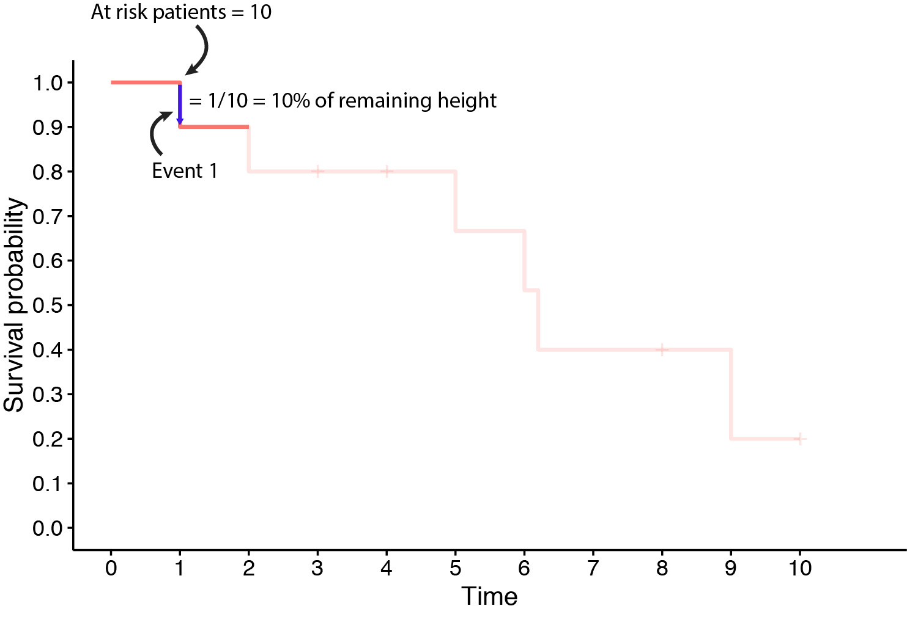

<style>
#TOC {
  top: 1%;
  opacity: 0.5;
}
#TOC:hover {
  opacity: 1;
}
</style>


```{r setup, include=FALSE}
knitr::opts_chunk$set(echo = TRUE)
require(survival)
require(survminer)
require(dplyr)
require(mediumr)
#load("KM.RData")
```

Kaplan-Meier curves are widely used in clinical and fundamental research, but there are some important pitfalls to keep in mind when making or interpreting them. In this short post, I'm going to give a basic overview of how data is represented on the Kaplan Meier plot. I have added the code for those who are interested.

The Kaplan-Meier estimator is used to estimate the survival function. The visual representation of this function is usually called the Kaplan-Meier curve, and it shows what the probability of an event (for example survival) is at a certain time interval. If the sample size is large enough, the curve should approach the true survival function for the population under investigation. Usually it will look similar to this:

```{r, warning = FALSE, echo=TRUE, message=F, comment=NA}
# Simulated data
patientID <- c(1:100)
followup <- sort(sample(50, 100, replace=TRUE))
eventtype <- rbinom(100, 1, 0.6)
scenario <- scenario <- c("A")
toy_datasetA <- data.frame(patientID, followup, eventtype, scenario)
colnames(toy_datasetA) <- c("PatientID", "Followup", "Eventtype", "Treatment")
toy_datasetA$Eventtype[toy_datasetA$Followup >= 48] <- 0
toy_datasetA$Followup[toy_datasetA$Followup >= 48] <- 48

patientID <- c(1:100)
followup <- sort(sample(65, 100, replace=TRUE))
eventtype <- rbinom(100, 1, 0.5)
scenario <- scenario <- c("B")
toy_datasetB <- data.frame(patientID, followup, eventtype, scenario)
colnames(toy_datasetB) <- c("PatientID", "Followup", "Eventtype", "Treatment")
toy_datasetB$Eventtype[toy_datasetB$Followup >= 48] <- 0
toy_datasetB$Followup[toy_datasetB$Followup >= 48] <- 48

toy_dataset <- rbind(toy_datasetA, toy_datasetB)

surv_object <- Surv(time = toy_dataset$Followup , event = toy_dataset$Eventtype)
fit1 <- survfit(surv_object ~ Treatment, data = toy_dataset)

j <- ggsurvplot(fit1, data = toy_dataset, conf.int = TRUE, pval = TRUE, pval.method = TRUE, xlim=c(0,50), risk.table = "nrisk_cumcensor", legend.title = " ", tables.theme = theme_cleantable(), break.time.by = 12,risk.table.fontsize = 4 ,risk.table.height = 0.20, surv.median.line = c("hv"), censor.shape = c("|"), censor.size = 6, axes.offset = FALSE, tables.y.text = FALSE)
```


```{r message=FALSE, warning=FALSE, echo = TRUE}
j$plot <- j$plot + 
  scale_y_continuous(breaks = sort(c(seq(0, 1, 0.1))))
j
```

The 95% CI are marked in gray and the median survival probability for scenario A is somewhere around 40 months. The survival time of patients that got treatment B is significantly longer.

The statistical tests to compare two curves are for a later time. In this example I'm only going to focus on the shape of one survival curve. 

## Basic Kaplan Meier plot
Let's start by creating some basic data. We have 10 patients "at risk", with a follow-up of 10 months. Every participant gets an identical treatment.

```{r global, message=FALSE, warning=FALSE, comment=NA, echo=FALSE}
colnames <- c("PatientID", "Followup", "Eventtype", "Scenario")
patientID <- c("John", "Jess", "Ann", "Mary", "Frank", "Steven", "Andy", "Elizabeth", "Joe", "Kate")
```

```{r scenario0}
patientID <- c("John", "Jess", "Ann", "Mary", "Frank", "Steven", "Andy", "Elizabeth", "Joe", "Kate")
followup <- c(1, 2, 3, 4, 5, 6, 7, 8, 9, 10)
eventtype <- c(1, 1, 1, 1, 1, 1, 1, 1, 1, 1)
scenario <- c("A", "A", "A", "A", "A", "A", "A", "A", "A", "A")
toy_dataset <- data.frame(patientID, followup, eventtype, scenario)
colnames(toy_dataset) <- c("PatientID", "Followup", "Eventtype", "Scenario")
```

If we take a closer look at the 'Follow-up' and 'Eventtype' columns:

* Follow-up time can be any time-interval: days, months, years. 
* Event type of 1 equals an event (for example death in an overall survival study)
* Event type of 0 equals a right-censored event. 

In this first example, there are no censored events.

```{r outputtable, message=FALSE, warning=FALSE, comment=NA, echo=TRUE}
toy_dataset <- data.frame(patientID, followup, eventtype, scenario)
colnames(toy_dataset) <- colnames

toy_dataset

```

```{r basicplotcode, warning=FALSE}
# We can plot this table with the `survival` and `survminer` packages. First, we define what the time column is (`toy_dataset$Followup`) and the event column is (`toy_dataset$Eventtype`). Afterwards, we can fit the Kaplan Meier curve to this data (`survfit(surv_object ~ Scenario)`). Note that in this simulation we are showing multiple scenarios, so we are fitting to `toy_dataset$Scenario`, but this can also be for example a treatment column.

surv_object <- Surv(time = toy_dataset$Followup , event = toy_dataset$Eventtype)
fit1 <- survfit(surv_object ~ Scenario, data = toy_dataset)

j <- ggsurvplot(fit1, data = toy_dataset, xlim = c(0,11), conf.int = FALSE,  risk.table = "nrisk_cumcensor", legend.title = " ", tables.theme = theme_cleantable(), break.time.by = 2,risk.table.fontsize = 4 ,risk.table.height = 0.20, censor.shape = c("|"), censor.size = 6)
```

Every month, 1 participant has an event (in an overall survival study this would be death). Every time an event occurs, the survival probability drops by 0.1 of the remaining curve (= #events / #at risk = $\frac{1}{10}$ of the remaining curve at month 1, $\frac{1}{9}$ of the remaining curve at month 2 and so on):

```{r basicplot, echo=TRUE, message=F, warning=F}
j$plot <- j$plot + 
  scale_x_continuous(breaks = sort(c(seq(0, 10, 1)))) + 
  scale_y_continuous(breaks = sort(c(seq(0, 1, 0.1))))
j
```

## Kaplan Meier plot with censored data
Let's add some censored data to the previous graph. 

Observations are called censored when the information about their survival time is incomplete; the most commonly encountered form is right censoring (as opposed to left and interval censoring, not discussed here). A patient who does not experience the event of interest for the duration of the study is said to be right censored. The survival time for this person is considered to be at least as long as the duration of the study. Another example of right censoring is when a person drops out of the study before the end of the study observation time and did not experience the event.

Ann, Mary and Elizabeth left the study before it was completed. Kate did not have an event at the end of the study. The curve is already looking very different compared to the "stairs" pattern from before.

```{r scenario1, warning = FALSE, echo=TRUE, message=F, warning=F, comment=NA}
followup <- c(1, 2, 3, 4, 5, 6, 6.2, 8, 9, 10)
eventtype <- c(1, 1,  0, 0, 1, 1, 1, 0, 1, 0)
```

```{r ref.label='outputtable', warning = FALSE, echo=TRUE, message=F, warning=F, comment=NA}
```

```{r ref.label='basicplotcode', warning = FALSE, echo=TRUE, message=F, warning=F}
```

```{r ref.label='basicplot', warning = FALSE, echo=TRUE, message=F, warning=F}
```

```{r, warning = FALSE, echo=FALSE, message=F, warning=F}
ggsave(file = "Censored.pdf", print(j), dpi = 72, width = 7, height = 7)
```

Now what is the relationship between events, censoring and the Kaplan Meier curve?

If we take a look at the first participant that has an event (John), we see that after 1 month we have a drop of 0.1, or 10% of the remaining height:

{width=80%}

If we wait a little bit longer, we can see that at month 5, there are 6 patients at risk remaining. Two have had an event and 2 have been censored. At the next event, the curve drops 16% of the remaining height (instead of 10% at the start of the study), because less people are at risk:

{width=80%}

This goes on until the end of the study period, or until the number of patients at risk reaches 0. The last drop is the largest, because only 2 people are at risk anymore. At this last drop, the curve drops 50% of the remaining height.

## Importance of confidence intervals
Especially when there are very few patients at risk, the impact of a censored event can have a big impact on the appearance of the KM curve. 

In the previous plot, it seems that the survival curve reaches a plateau at 0.2 surival probability (curve A). If we would swap the censored status between Joe and Kate (participants 9 and 10), the KM curve changes drastically and drops to 0 at the end of the study period. In this scenario (curve B), all participants either had an event or were censored.

```{r scenario2, warning = FALSE, echo=TRUE, message=F, warning=F, comment=NA}
followup <- c(1, 2, 3, 4, 5, 6, 6.2, 8, 9, 10, 1, 2, 3, 4, 5, 6, 6.2, 8, 9, 10)
eventtype <- c(1, 1,  0, 0, 1, 1, 1, 0, 1, 0, 1, 1,  0, 0, 1, 1, 1, 0, 0, 1)
scenario <- rep(c("A", "B"), each = 10)
```

```{r message=FALSE, warning=FALSE, comment=NA, echo=TRUE}
toy_dataset <- data.frame(patientID, followup, eventtype, scenario)
colnames(toy_dataset) <- colnames
for (value in unique(toy_dataset$Scenario)){
  print(tail((toy_dataset[toy_dataset$Scenario == value,]),2))
}
toy_dataset$Followup = ifelse(toy_dataset$Scenario == "A", toy_dataset$Followup + 0.07, toy_dataset$Followup + 0) # small offset otherwise curves would almost fully overlap.
```

```{r ref.label='basicplotcode', warning = FALSE, echo=TRUE, message=F, warning=F}
```

```{r ref.label='basicplot', warning = FALSE, echo=TRUE, message=F, warning=F}
```

In other words, only one events marks the difference between the survival curve reaching 0 or reaching a plateau staying stable at 0.2. 

We can also see this is if we plot the 95% confidence intervals on the KM curve. The confidence intervals are very wide, giving a clue that the study contains very few participants:

```{r, warning=FALSE, warning = FALSE, echo=TRUE, message=F, warning=F}
toy_dataset = subset(toy_dataset, Scenario == "A")

surv_object <- Surv(time = toy_dataset$Followup , event = toy_dataset$Eventtype)
fit1 <- survfit(surv_object ~ Scenario, data = toy_dataset)

j <- ggsurvplot(fit1, data = toy_dataset, xlim = c(0,11), conf.int = TRUE,  risk.table = "nrisk_cumcensor", legend.title = " ", tables.theme = theme_cleantable(), break.time.by = 2, risk.table.fontsize = 4, risk.table.height = 0.20,  censor.shape = c("|"), censor.size = 6)
```

```{r ref.label='basicplot', warning = FALSE, echo=TRUE, message=F, warning=F}
```

## Exclude censored data: yes or no?
### Small dataset
We can simulate the best case scenario (all censoring = no events) and the worst case scenario (all censoring = events) and compare this to the actual curve (scroll through the data sheet to see the differences).

```{r scenario3, warning = FALSE, echo=TRUE, message=F, warning=F, comment=NA}
followup <-  c(1, 2, 10, 10, 5, 6, 6.2, 10, 10, 10, 1, 2, 2, 2, 5, 6, 6.2, 9, 9, 10, 1, 2, 3, 4, 5, 6, 6.2, 8, 9, 10)
eventtype <- c(1, 1, 0, 0, 1, 1, 1, 0, 1, 0, 1, 1, 1, 1, 1, 1, 1, 1, 1, 1, 1, 1,  0, 0, 1, 1, 1, 0, 0, 1)
scenario <- rep(c("Best", "Worst", "Actual"), each = 10)
```

```{r message=FALSE, warning=FALSE, comment=NA, echo=TRUE}
toy_dataset <- data.frame(patientID, followup, eventtype, scenario)
colnames(toy_dataset) <- colnames

toy_dataset
```

```{r, warning = FALSE, echo=TRUE, message=F, warning=F}
surv_object <- Surv(time = toy_dataset$Followup , event = toy_dataset$Eventtype)
fit1 <- survfit(surv_object ~ Scenario, data = toy_dataset)

j <- ggsurvplot(fit1, data = toy_dataset, xlim = c(0,11), conf.int = FALSE,  risk.table = "nrisk_cumcensor", legend.title = " ", tables.theme = theme_cleantable(), break.time.by = 2,  censor.shape = c("|"), censor.size = 6)
```

In the best case scenario, the curve stops at 0.5 at the end of the study, while in the worst case scenario the curve drops to 0. The median survival times are also very different:

* Actual curve: 6.2 months
* Best case: 8.1 months
* Worst case: 5.5 months

```{r ref.label='basicplot', warning = FALSE, echo=TRUE, message=F, warning=F}
```

### Large dataset
This is even more striking if we increase the sample size. In the simulation, the sample size has increased from 10 to 100, with a follow-up time of 48 months. In this simulation, 40% of the individuals are censored (at random) somewhere between month 0 and month 48. Again, this shows that the median survival time can be substantially different.


```{r, warning = FALSE, echo=TRUE, message=F, warning=F, comment=NA}


patientID <- c(1:100)
followup <- sort(sample(55, 100, replace=TRUE))
eventtype <- rbinom(100, 1, 0.6)
scenario <- scenario <- rep(c("Actual", "Best", "Worst"), each = 100)
toy_dataset <- data.frame(patientID, followup, eventtype, scenario)
colnames(toy_dataset) <- c("PatientID", "Followup", "Eventtype", "Scenario")
toy_dataset$Eventtype[toy_dataset$Followup >= 48] <- 0
toy_dataset$Followup[toy_dataset$Followup >= 48] <- 48

toy_dataset$Eventtype = ifelse(toy_dataset$Scenario == "Worst", 
                              ifelse(toy_dataset$Eventtype == 0, toy_dataset$Eventtype + 1, toy_dataset$Eventtype), toy_dataset$Eventtype)
tmp <- subset(toy_dataset, Scenario=='Best')
toy_dataset <- subset(toy_dataset, Scenario=='Worst' | Scenario=='Actual')
tmp$Followup[tmp$Eventtype %in% 0] <- 48
toy_dataset <- rbind(toy_dataset, tmp)
```


```{r, warning = FALSE, echo=TRUE, message=F, warning=F}
surv_object <- Surv(time = toy_dataset$Followup , event = toy_dataset$Eventtype)
fit1 <- survfit(surv_object ~ Scenario, data = toy_dataset)

j <- ggsurvplot(fit1, data = toy_dataset, conf.int = FALSE, xlim=c(0,50), risk.table = "nrisk_cumcensor", legend.title = " ", tables.theme = theme_cleantable(), break.time.by = 12,risk.table.fontsize = 4 ,risk.table.height = 0.20, surv.median.line = c("hv"), censor.shape = c("|"), censor.size = 6)
```

```{r echo=TRUE, message=FALSE, warning=FALSE, echo = FALSE}
j$plot <- j$plot + 
  scale_y_continuous(breaks = sort(c(seq(0, 1, 0.1))))
j
```

```{r, warning = FALSE, echo=TRUE, message=F, warning=F, comment=NA}
#res.sum <- surv_summary(fit1, data = toy_dataset)
#attr(res.sum, "table")
```

## Conclusions
* Censored data can substantially affect the KM curve, but have to be included when fitting the curve.
* Show censored data on the curve as much as possible.
* Be cautious when interpreting the end of the KM if there are big drops present.
* The height of the drop can inform you about the number of patients at risk, even when it’s not reported or when there are no confidence intervals shown.

## References
This post has been inspired by the explanation given by Pancanology: https://www.youtube.com/watch?v=KE1tkZmWhqU.

Definitions about censoring: https://www.cscu.cornell.edu/news/statnews/stnews78.pdf 

Rmd tips: https://holtzy.github.io/Pimp-my-rmd/

```{r}
sessionInfo()
#save.image(file = "KM.RData")
```